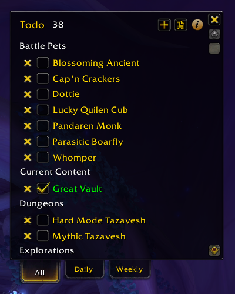
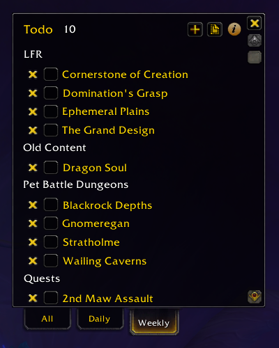
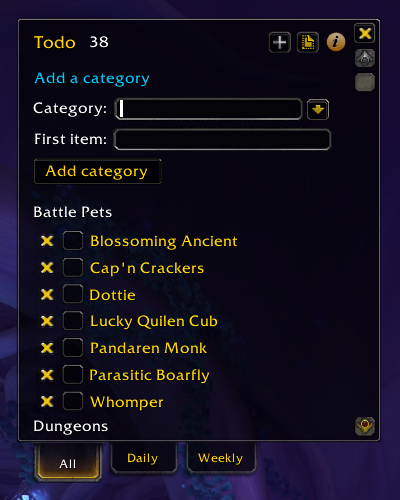

# Todo Add-on

Track your daily, weekly, and long-term goals using categories and profiles. Tasks created in Daily tab automatically reset each day at 8:00am (configurable in options) and tasks created in the Weekly tab reset each Tuesday (configurable in options). 

## Usage
1. Install the Todo add-on using CurseForge, WowUp, or any other add-on manager.
2. Open the Todo window using the minimap button or the `/todo` command.
3. Follow the on-screen tutorial to create a new category and todo item
4. Open the add-on options to set a custom key binding and fine-tune your settings

## Credit
Forked from [Ny's To-Do List add-on](https://www.curseforge.com/wow/addons/nys-todolist) and adapted by Peter Wooley